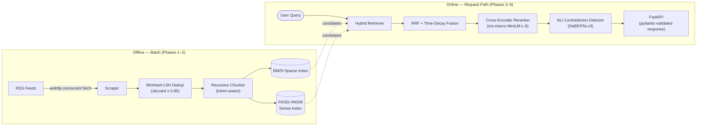

# News Intelligence RAG — Hybrid Temporal Retrieval with Contradiction Detection

<p align="left">
  
  
  
  
  
</p>

A production-grade Retrieval-Augmented Generation system for news, built to go **beyond a naive retrieve-then-generate baseline**. It fuses **sparse (BM25)** and **dense (FAISS HNSW)** retrieval through **Reciprocal Rank Fusion**, applies an **exponential recency decay** so that breaking developments outrank stale coverage, **reranks** candidates with a cross-encoder, and **flags cross-source contradictions** with a DeBERTa NLI head. Every answer is **grounded at the sentence level** with citations.

The design goal is not "a demo that returns chunks." It is a **decoupled, observable, strictly-typed pipeline** that a reviewer can read top-to-bottom and trust.

---

## Table of Contents

1. [Why this exists](#why-this-exists)
2. [System Architecture](#system-architecture)
3. [The Five Phases](#the-five-phases)
4. [The Math](#the-math)
   - [Reciprocal Rank Fusion](#1-reciprocal-rank-fusion-rrf)
   - [Exponential Time Decay](#2-exponential-time-decay)
   - [Final Temporal Fusion Score](#3-final-temporal-fusion-score)
   - [NLI Contradiction Detection](#4-nli-contradiction-detection)
5. [Evaluation Methodology](#evaluation-methodology)
6. [Project Structure](#project-structure)
7. [Installation](#installation)
8. [Quickstart](#quickstart)
9. [API Reference](#api-reference)
10. [Configuration](#configuration)
11. [Design Decisions & Trade-offs](#design-decisions--trade-offs)
12. [Edge Cases & Failure Modes](#edge-cases--failure-modes)
13. [Roadmap](#roadmap)
14. [Author & License](#author--license)

---

## Why this exists

Most RAG tutorials stop at *embed → cosine search → stuff into prompt*. That falls apart on a news corpus for three concrete reasons:

| Problem in real news data | Naive RAG behaviour | What this system does |
|---|---|---|
| **Wire duplication** — AP/Reuters stories are republished verbatim by dozens of outlets | Index bloats; the same fact is retrieved 10× and crowds out diversity | MinHash-LSH dedup at ingestion (Jaccard ≥ 0.85) |
| **Recency matters** — an 18-month-old article and today's update can be lexically identical | Pure semantic similarity is time-blind and surfaces stale facts | Exponential **time-decay** multiplied into the fused score |
| **Vocabulary mismatch + paraphrase** — queries use different words than headlines | Dense-only misses exact entities; sparse-only misses paraphrase | **Hybrid** BM25 + dense, merged with **RRF** |
| **Sources disagree** — outlets report conflicting casualty figures, dates, claims | The LLM silently picks one and presents it as fact | **NLI contradiction detection** flags the conflict explicitly |

This repository treats those four problems as first-class engineering requirements rather than afterthoughts.

---

## System Architecture

The pipeline is **decoupled into five independently testable stages**. Ingestion/indexing run offline (batch); retrieval/validation/serving run online (request path).



**Key architectural property:** the indices are an *artifact*. The online path never touches the network for retrieval — it loads a pre-built BM25 store and a serialized FAISS graph. This keeps p99 latency bounded and makes the service horizontally scalable.

---

## The Five Phases

### Phase 1 — Async ETL & Deduplication (`src/ingestion/`)
- `scraper.py` — `aiohttp`-based concurrent RSS fetcher with a bounded semaphore, per-host politeness, `tenacity` exponential-backoff retries, and tolerant timestamp parsing.
- `dedup.py` — `datasketch` **MinHash + LSH** to remove near-duplicate wire stories at a **Jaccard threshold of 0.85** before they ever reach the index. Shingling is configurable (word n-grams).

### Phase 2 — Hybrid Indexing (`src/indexing/`)
- `chunker.py` — `langchain_text_splitters.RecursiveCharacterTextSplitter` with overlap, carrying article metadata (source, URL, `published_at`) onto every chunk.
- `vector_store.py` — builds **two** indices: a `rank_bm25` Okapi sparse index and a `faiss-cpu` **HNSW** graph over `all-MiniLM-L6-v2` (384-d) embeddings. Handles persistence, atomic reload, and the **empty-index** case.

### Phase 3 — Temporal Retrieval (`src/retrieval/`)
- `search.py` — runs sparse and dense retrieval, returning ranked candidate lists.
- `fusion.py` — merges them with **Reciprocal Rank Fusion**, then multiplies each document's fused score by an **exponential recency weight** derived from `published_at`.

### Phase 4 — Validation & Reranking (`src/generation/`)
- `validator.py` — reranks the fused top-N with `cross-encoder/ms-marco-MiniLM-L-6-v2`, then runs **NLI** (`microsoft/deberta-v3-small`) between each retrieved **premise** and the generated **hypothesis** to detect entailment / neutrality / **contradiction**, producing sentence-level citation grounding.

### Phase 5 — Serving (`src/api/`)
- `schemas.py` — strict `pydantic` v2 request/response models.
- `main.py` — `FastAPI` app: lifespan-managed model loading, `/health`, `/search`, and `/answer` endpoints, structured logging, and graceful degradation.

---

## The Math

### 1. Reciprocal Rank Fusion (RRF)

RRF combines multiple ranked lists **using only ranks, not raw scores** — which is exactly what we want, because BM25 scores (unbounded) and cosine similarities (∈ [−1, 1]) are not directly comparable and normalizing them is brittle.

For a document $d$ and a set of rankers $\mathcal{R}$ (here: BM25 and FAISS):

$$
\text{RRF}(d) = \sum_{r \in \mathcal{R}} \frac{1}{k + \text{rank}_r(d)}
$$

where $\text{rank}_r(d)$ is the 1-based position of $d$ in ranker $r$'s list, and $k$ is a smoothing constant (default **$k = 60$**, the value from the original Cormack et al. work).

**Intuition for $k$:** a large $k$ flattens the contribution of top ranks, making fusion more democratic across rankers; a small $k$ sharply rewards being #1 in *any* single ranker. $k = 60$ is a well-validated default.

> A document missing from a ranker's top-$m$ list contributes **0** from that ranker (equivalently, $\text{rank}_r(d) \to \infty$).

### 2. Exponential Time Decay

News relevance decays with age. We weight each document by an exponential function of its age $\Delta t_d$ (in hours):

$$
w_{\text{time}}(d) = \exp\!\left(-\lambda \cdot \Delta t_d\right), \qquad \Delta t_d = t_{\text{now}} - t_{\text{published}}(d)
$$

Rather than expose the opaque rate $\lambda$ directly, we parameterize it by an intuitive **half-life** $H$ (the age at which an article's recency weight halves):

$$
w_{\text{time}}(d) = \tfrac{1}{2} \;\Longleftrightarrow\; \lambda H = \ln 2 \;\Longrightarrow\; \boxed{\lambda = \frac{\ln 2}{H}}
$$

So with a half-life of `H = 72` hours, a 3-day-old article retains 50% of its recency weight, a 6-day-old article 25%, and so on. $w_{\text{time}}(d) \in (0, 1]$ and equals 1 for a just-published article.

> **Edge case:** documents with a missing or unparseable `published_at` are assigned a configurable neutral weight (default `1.0`, i.e. no penalty) rather than being silently dropped — see [Edge Cases](#edge-cases--failure-modes).

### 3. Final Temporal Fusion Score

The recency weight **multiplies** the rank-fusion score:

$$
\text{score}(d) = \text{RRF}(d) \cdot w_{\text{time}}(d) = \left(\sum_{r \in \mathcal{R}} \frac{1}{k + \text{rank}_r(d)}\right)\exp\!\left(-\frac{\ln 2}{H}\,\Delta t_d\right)
$$

Documents are then re-sorted by $\text{score}(d)$ and the top-$N$ are passed to the cross-encoder reranker. Because decay is multiplicative, a stale document must be *substantially* better-ranked to outrank a fresh one — which is the desired behaviour for a news system.

### 4. NLI Contradiction Detection

After generation, each retrieved **premise** sentence $p$ and the generated **hypothesis** $h$ are scored by a 3-class NLI model:

$$
\big[\,P_{\text{ent}},\, P_{\text{neu}},\, P_{\text{con}}\,\big] = \operatorname{softmax}\big(f_{\text{NLI}}(p, h)\big)
$$

- **Citation grounding:** a hypothesis sentence is considered *supported* by premise $p$ iff $P_{\text{ent}}(p,h) \geq \tau_{\text{ent}}$.
- **Contradiction flag:** sources are flagged as conflicting iff $P_{\text{con}}(p,h) \geq \tau_{\text{con}}$.

Both thresholds ($\tau_{\text{ent}}$, $\tau_{\text{con}}$) are configurable. This turns "trust me" into "here is the supporting sentence — and here are the two sources that disagree."

---

## Evaluation Methodology

The repo ships an offline evaluation harness (Phase 6, optional) that benchmarks retrieval against a labelled qrels file using standard IR metrics:

**Recall@k** — fraction of relevant documents retrieved in the top $k$:

$$
\text{Recall@}k = \frac{|\{\text{relevant}\} \cap \{\text{top-}k\text{ retrieved}\}|}{|\{\text{relevant}\}|}
$$

**Mean Reciprocal Rank** — how high the first relevant hit sits, averaged over queries $Q$:

$$
\text{MRR} = \frac{1}{|Q|}\sum_{q \in Q}\frac{1}{\text{rank}_q^{\text{first-relevant}}}
$$

**Normalized Discounted Cumulative Gain** — rewards placing highly-relevant docs near the top:

$$
\text{DCG@}k = \sum_{i=1}^{k}\frac{2^{\text{rel}_i}-1}{\log_2(i+1)}, \qquad \text{NDCG@}k = \frac{\text{DCG@}k}{\text{IDCG@}k}
$$

These three together capture **coverage** (Recall), **first-hit quality** (MRR), and **graded ranking quality** (NDCG) — the rigor a reviewer expects beyond a single number.

---

## Project Structure

```
news-intelligence-rag/
├── src/
│   ├── ingestion/
│   │   ├── scraper.py        # async RSS fetch (aiohttp, tenacity, semaphore)
│   │   └── dedup.py          # MinHash-LSH near-duplicate removal
│   ├── indexing/
│   │   ├── chunker.py        # recursive, metadata-preserving chunking
│   │   └── vector_store.py   # BM25 + FAISS HNSW build/persist/reload
│   ├── retrieval/
│   │   ├── search.py         # sparse + dense candidate retrieval
│   │   └── fusion.py         # RRF + exponential time decay
│   ├── generation/
│   │   └── validator.py      # cross-encoder rerank + DeBERTa NLI
│   └── api/
│       ├── main.py           # FastAPI app, lifespan model loading
│       └── schemas.py        # strict pydantic request/response models
├── requirements.txt
└── README.md
```

---

## Installation

### Prerequisites
- Python **3.10–3.12** (3.11 recommended)
- ~2 GB free disk for model weights (downloaded on first run)
- macOS / Linux / WSL2

### Steps

```bash
# 1. Clone
git clone https://github.com/Udiation/news-intelligence-rag.git
cd news-intelligence-rag

# 2. Create an isolated environment
python -m venv .venv
source .venv/bin/activate        # Windows: .venv\Scripts\activate

# 3. Install dependencies
pip install --upgrade pip
pip install -r requirements.txt
```

> **DeBERTa-v3 tokenizer note:** `microsoft/deberta-v3-*` uses a SentencePiece tokenizer. `sentencepiece` and `protobuf` are already pinned in `requirements.txt` for this reason — without them the NLI model will fail to load with a `Converting from SentencePiece` error.

> **Model weights** for `all-MiniLM-L6-v2`, `ms-marco-MiniLM-L-6-v2`, and `deberta-v3-small` are pulled from the Hugging Face Hub on first use and cached under `~/.cache/huggingface`. To pre-warm in CI, run the build script once before serving.

---

## Quickstart

```bash
# 1. Build the indices from your configured RSS feeds (offline)
python -m src.indexing.vector_store --build

# 2. Launch the API (online)
uvicorn src.api.main:app --host 0.0.0.0 --port 8000

# 3. Query it
curl -X POST http://localhost:8000/answer \
     -H "Content-Type: application/json" \
     -d '{"query": "latest on the semiconductor export restrictions", "top_k": 5}'
```

---

## API Reference

| Method | Endpoint   | Purpose |
|--------|-----------|---------|
| `GET`  | `/health` | Liveness + reports whether indices are loaded and non-empty |
| `POST` | `/search` | Hybrid temporal retrieval only — returns ranked, decayed, reranked chunks |
| `POST` | `/answer` | Full pipeline — retrieval + grounded answer + contradiction report |

Full request/response contracts are defined as `pydantic` models in `src/api/schemas.py` and surfaced automatically at `/docs` (Swagger) and `/redoc`.

---

## Configuration

All tunables are exposed via environment variables (12-factor) through `pydantic-settings`, e.g.:

| Variable | Default | Meaning |
|---|---|---|
| `RRF_K` | `60` | RRF smoothing constant $k$ |
| `TIME_DECAY_HALFLIFE_HOURS` | `72` | Recency half-life $H$ |
| `DEDUP_JACCARD_THRESHOLD` | `0.85` | MinHash-LSH duplicate cutoff |
| `CHUNK_SIZE` / `CHUNK_OVERLAP` | `512` / `64` | Chunker parameters |
| `RETRIEVAL_TOP_K` | `50` | Candidates fused before rerank |
| `RERANK_TOP_N` | `10` | Survivors after cross-encoder |
| `NLI_CONTRADICTION_THRESHOLD` | `0.50` | $\tau_{\text{con}}$ |
| `NLI_ENTAILMENT_THRESHOLD` | `0.50` | $\tau_{\text{ent}}$ |

---

## Design Decisions & Trade-offs

- **Why RRF over weighted score normalization?** BM25 and cosine live on incomparable scales; normalizing them (min-max, z-score) is corpus-dependent and unstable as the index grows. Rank fusion sidesteps the calibration problem entirely.
- **Why HNSW over a flat / IVF index?** HNSW gives strong recall at low latency for the corpus sizes typical of a news index, with no training step (unlike IVF-PQ). The recall/latency knob (`efSearch`) is tunable at query time.
- **Why multiplicative (not additive) time decay?** Multiplication makes recency a *modulator* of relevance rather than an independent additive term, so a wildly off-topic-but-fresh article can't float to the top on recency alone.
- **Why a cross-encoder rerank stage at all?** Bi-encoders (used for the FAISS index) trade accuracy for the ability to pre-compute embeddings. A cross-encoder re-scores the *small* fused candidate set with full query-document attention — the classic retrieve-cheap-then-rerank-precisely pattern.
- **Why offline/online decoupling?** Index builds are CPU/IO-heavy and bursty; serving must be low-latency and stateless. Separating them lets each scale independently.

---

## Edge Cases & Failure Modes

This system is written to **degrade gracefully**, not crash. Explicitly handled:

- **Empty FAISS / BM25 index** — `/search` and `/answer` return a structured `200` with an empty result set and a `warning` field rather than a `500`; `/health` reports `indices_loaded: false`. The build script refuses to serialize an empty graph.
- **Feed timeouts / 5xx** — `tenacity` retries with backoff; permanently failing feeds are logged and skipped, never aborting the whole crawl.
- **Malformed / missing timestamps** — fall back to a neutral recency weight (`1.0`) instead of dropping the document or crashing the decay computation.
- **Zero candidates after dedup** — short-circuits cleanly with a logged warning.
- **NLI / reranker model load failure** — the service can be configured to start in *retrieval-only* mode (answer endpoint disabled) so partial outages don't take down search.
- **Query longer than model context** — truncated with a logged warning at the tokenizer boundary.
- **All candidates identical (post-dedup collision)** — RRF degenerates gracefully; the reranker breaks ties deterministically.

---

## Roadmap

- [ ] Incremental / streaming index updates (append without full rebuild)
- [ ] Optional GPU FAISS (`faiss-gpu`) for larger corpora
- [ ] Cross-encoder distillation for sub-50 ms rerank
- [ ] Entity-level (not just sentence-level) contradiction localization
- [ ] Containerized deployment (Dockerfile + compose)

---

## Author & License

**Author:** Udit Narayan · [GitHub @Udiation](https://github.com/Udiation) · [LinkedIn](https://www.linkedin.com/in/udit-narayan-a98542321)

Released under the **MIT License**. See `LICENSE` for details.

> If you build on this, a citation or a ⭐ is appreciated.
